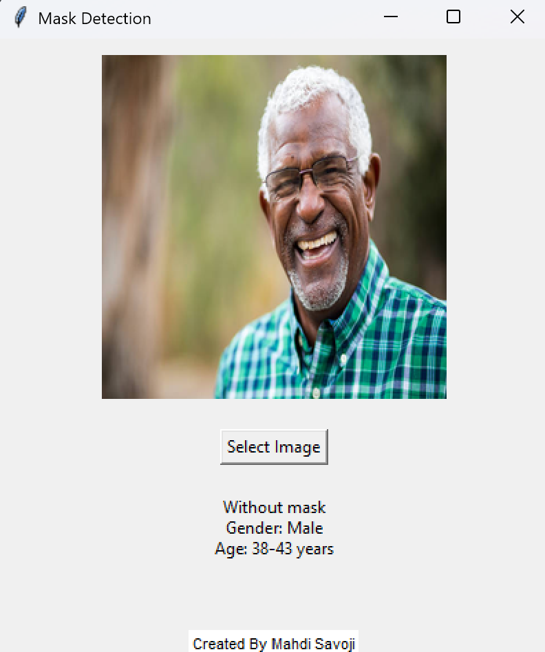

# Mask and Face Attribute Detection App

A desktop GUI application for detecting whether a person is wearing a mask or not, and—if no mask is detected—estimating their **age**, **gender**.


## 🔍 Features

- **Mask Detection** using a fine-tuned InceptionV3 model.
- **Age & Gender Estimation** using OpenCV DNN models.
- **Simple GUI** built with Tkinter for selecting and processing images.
- **Automatic face detection** and annotation if mask is not worn.

## 🖼️ Example Result



**Output in GUI (if no mask):**

- Age: 25–32 years  
- Gender: Male  
- Gaze: Looking Left

------

## 🧠 Model Training

The **mask detection model** was trained using the InceptionV3 architecture in a custom Jupyter Notebook:

📓 [Train-MaskVSwihtoutMaskModel.ipynb](./Train-MaskVSwihtoutMaskModel.ipynb)

You can download the trained model file (`my_InceptionV3.h5`) from the following link:

🔗 [Download Model from Google Drive](https://drive.google.com/file/d/1iT2gndF0LtGfr97n3JLixMuzdk3ccmeV/view?usp=sharing)

> After downloading, place it in the root directory and ensure the filename is exactly: `my_InceptionV3.h5`

------

## 🛠 Requirements

- Python 3.7+
- TensorFlow 2.x
- OpenCV
- PIL (Pillow)
- MediaPipe
- scikit-learn
- NumPy
- Tkinter (usually included with Python)

### Install Requirements

```bash
pip install -r requirements.txt
```

### Install Requirements

```bash
pip install -r requirements.txt
```

> Example `requirements.txt`:

```
tensorflow
opencv-python
mediapipe
Pillow
scikit-learn
numpy
```

------

## 🚀 How to Run

1. Clone the repository:

   ```bash
   git clone https://github.com/yourusername/mask-face-attribute-app.git
   cd mask-face-attribute-app
   ```

2. Make sure your trained model file `my_InceptionV3.h5` is in the root directory.

3. Run the application:

   ```bash
   python app.py
   ```

4. Click "Select Image" to choose a photo for evaluation.

------

## 📂 Project Structure

```
├── app.py                 # Main Tkinter GUI app
├── my_InceptionV3.h5      # Pre-trained mask detection model
├── test.png               # Example input image
├── output.gif             # Demo of app behavior
├── README.md
└── requirements.txt       # Python dependencies
```

------

## 📸 Output Preview

When an image is selected, the application performs:

- Mask classification
- If no mask → face detection → gender & age estimation
- Eye gaze direction

------

## ✍️ Author

**Mahdi Savoji**

